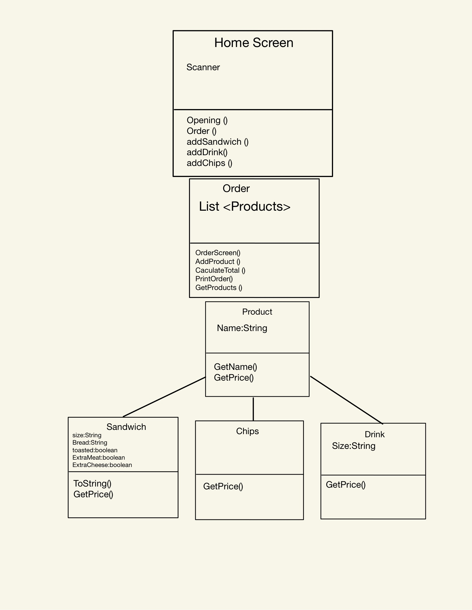
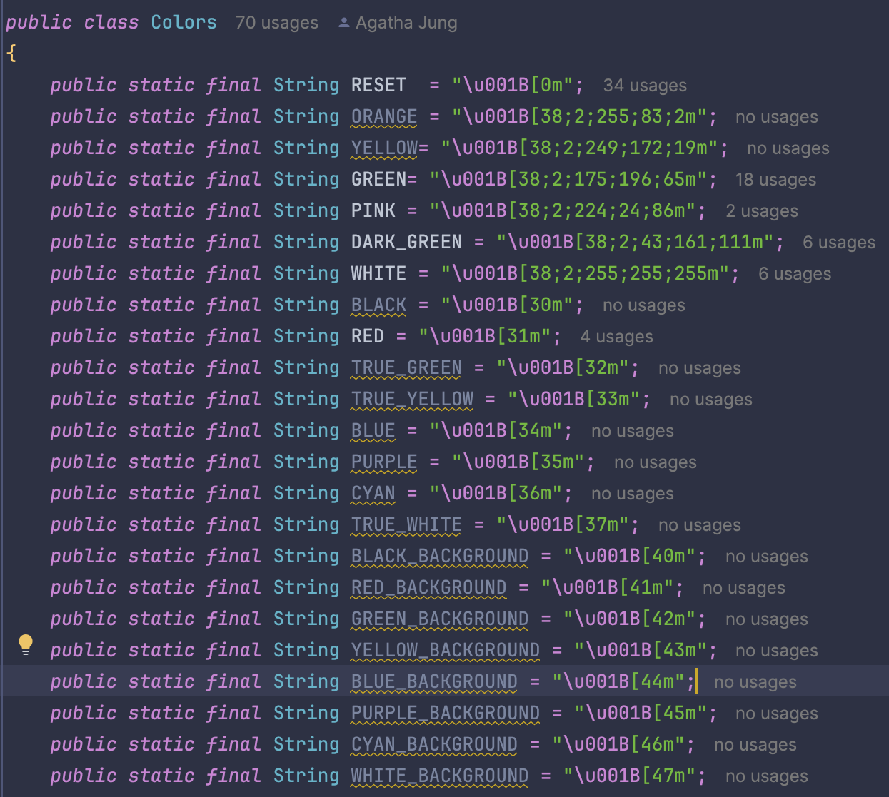
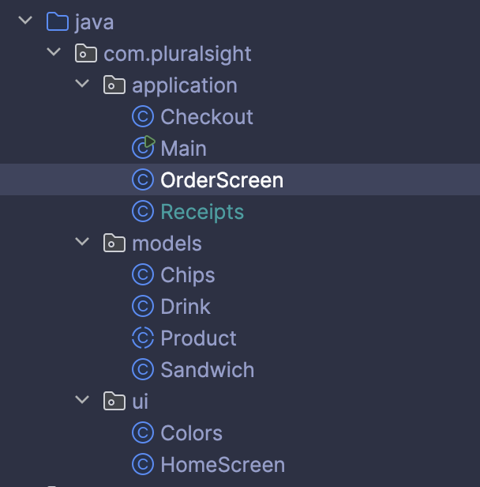
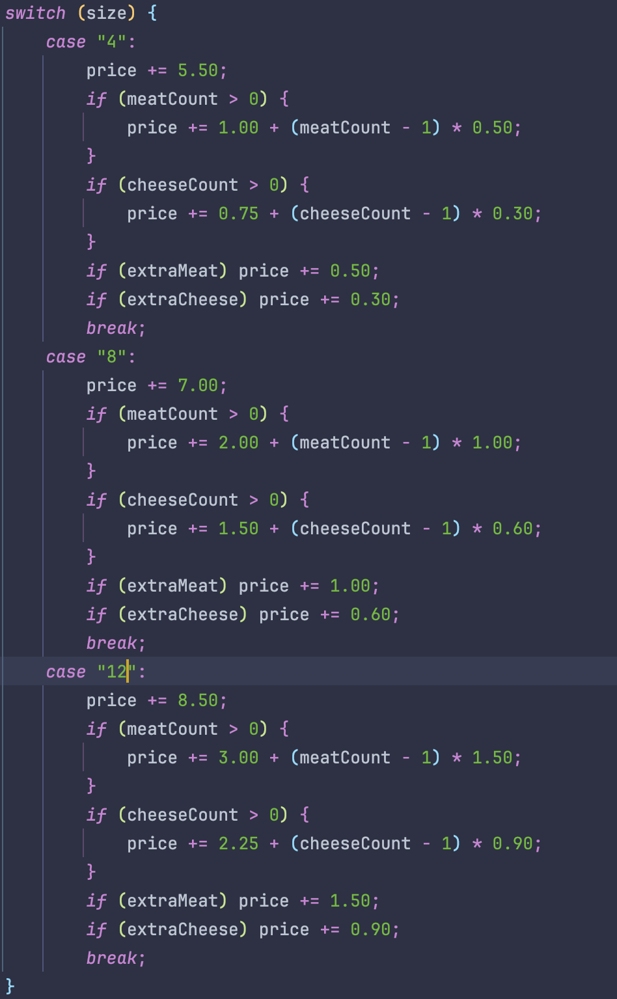
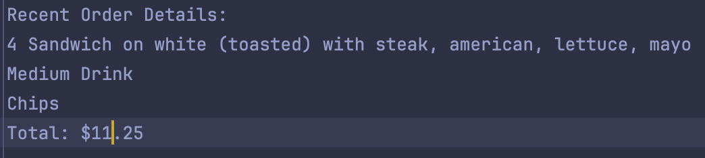

# Jung 'n' Juicy Deli Shop
Isn't the title so appetizing? 
Our company not only provides a tasty and emmaculate dining experience, but an equally captivating ordering experience!

### Diagram

I had a lot of issues with my logic and had to redo my diagrams multiple times, eventually settling on this. 
I wanted to encorporate **inheritance** to make my classes smoother.
I also wanted to exercise my use of **Lists** and **ArrayLists**. 

## UI

I broadened my "company" by adding color that fits with my brand. Although there are many unused colors, as I build my app further, I hope to utilize more color.

## Organization

Can't emphasize enough how much it helped me to have my classes organized and set up in a way that helped me keep my code clean! As a beginner, I used to find that it's easier to code everything at once, but now that I have been introduced, it's been such a life - saver and great tactic!

## Trials and Errors

This capstone definitetly pushed me to exercise a lot of skills and brain power (lol). I had a difficult time getting my calculations logic correct as well as my receipts. I then found out I programmed the options in a way that users had to input a """ after the size bread they chose. 

Since my calculation was faulty in the beginning (or at least the logic to get it to calculate) my receipt wasn't printing properly! But w got it to work in the end! 

